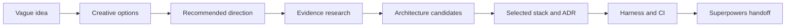

# Project Forge

[](LICENSE)
[](CHANGELOG.md)
[](.)

**Decide what to build, why it should exist, and which architecture fits before implementation begins.**

Project Forge is a decision and architecture plugin for Codex and Claude Code. It turns an early idea into:

- a recommended product direction;
- current research evidence;
- compared architecture candidates;
- an accepted architecture decision record;
- a reproducible harness contract;
- a clean handoff to Superpowers.

Project Forge does not replace Superpowers. Project Forge owns product direction, evidence, architecture, and verification contracts. Superpowers owns implementation disciplines such as planning, TDD, debugging, code review, and branch completion.

## Workflow



## What You Get

| Worker | Responsibility | Primary artifact |
|---|---|---|
| Creative Design Director | Product angles, target user, competitive gap, differentiation | `docs/creative-brief.md` |
| AI Architect | Candidate comparison, stack selection, rejected options, confidence | `docs/architecture/ADR-0001-stack.md` |
| Harness Engineer | Install, test, lint, typecheck, build, run, smoke, and CI contracts | `project-forge.yaml` |
| Forge Coordinator | Research, decision history, backups, and Superpowers handoff | `.project-forge/` and `docs/superpowers-handoff.md` |

## Install

### Codex

```powershell
New-Item -ItemType Directory -Force -Path "$env:USERPROFILE\plugins" | Out-Null
git clone https://github.com/Haozhenyu123/project-forge.git "$env:USERPROFILE\plugins\project-forge"
Copy-Item -Force "$env:USERPROFILE\plugins\project-forge\install\codex-marketplace.personal.json" "$env:USERPROFILE\.agents\plugins\marketplace.json"
```

### Claude Code

Run from Claude Code:

```text
/plugin install $env:USERPROFILE\plugins\project-forge
```

## Quick Start

Preview a run without writing files:

```powershell
python scripts/cli.py init my-app --stack nextjs --goal "A focused sprint dashboard" --dry-run
```

Create the decision and harness artifacts:

```powershell
python scripts/cli.py init my-app --stack nextjs --goal "A focused sprint dashboard"
```

Inspect the installation and available runtime integrations:

```powershell
python scripts/cli.py doctor
```

Detect an existing project's stack:

```powershell
python scripts/cli.py detect . --json
```

Research a current architecture question:

```powershell
python scripts/cli.py research --query "offline-first collaborative web application"
```

List and restore backups:

```powershell
python scripts/cli.py backups my-app
python scripts/cli.py restore <backup-id> my-app --force
```

## Safety

- Existing generated files are not overwritten by default.
- `--force` creates a backup under `.project-forge/backups/`.
- Every successful Forge run records decision history under `.project-forge/history/`.
- `--dry-run` reports planned files and conflicts without modifying the project.
- Missing search credentials produce provisional evidence instead of fabricated claims.

## Available Templates

| Template | Stack | Detection signal |
|---|---|---|
| `node-ts` | Node.js and TypeScript | `package.json` |
| `nextjs` | Next.js App Router | `next` dependency |
| `electron` | Electron desktop | `electron` dependency |
| `cli` | Node.js CLI | `bin` in `package.json` |
| `chrome-extension` | Chrome Extension MV3 | `manifest.json` |
| `python` | Python | `pyproject.toml` or `requirements.txt` |
| `fastapi` | FastAPI | FastAPI project signal |
| `generic` | Any stack | Explicit fallback |

## Verify

```powershell
python -m unittest tests/test_project_forge.py
python scripts/install_test.py
python scripts/evals/validate_scenarios.py evals/scenarios
```

## Update

```powershell
git pull origin main
python scripts/install_test.py
python scripts/cli.py doctor
```

## 中文快速入门

Project Forge 负责在编码之前回答三个问题：

1. 做什么产品，面向谁，从哪个切入点开始。
2. 为什么选择这个方向，证据是什么。
3. 使用什么架构、框架和 Harness，为什么这样选择。

它会生成创意简报、研究证据、候选架构比较、ADR、命令契约、CI 和 Superpowers 交接文件。它不会重新实现 Superpowers 的 TDD、调试、代码审查或 Git 工作流。

```powershell
python scripts/cli.py init my-app --stack nextjs --goal "一个帮助小团队聚焦冲刺目标的仪表盘" --dry-run
python scripts/cli.py init my-app --stack nextjs --goal "一个帮助小团队聚焦冲刺目标的仪表盘"
```

## Documentation

- [Architecture overview](docs/architecture.md)
- [Quickstart guide](docs/quickstart.md)
- [Superpowers handoff protocol](docs/superpowers-handoff.md)
- [Contributing](CONTRIBUTING.md)
- [Changelog](CHANGELOG.md)

## License

MIT
