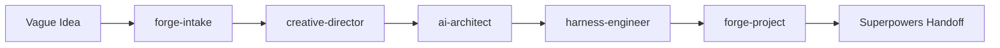

# Project Forge

[](LICENSE)
[](CHANGELOG.md)
[](.)

**Decide what to build and why — before you write a single line of code.**

Project Forge is a dual-harness plugin for Codex and Claude Code. It adds an AI Creative Design Director and an AI Architect to your workflow, so every project starts with a clear product direction, competitive analysis, evidence-backed architecture, and a verifiable harness — then hands off to Superpowers for implementation.


## ?????? (Chinese Quickstart)

### ??? Project Forge?

Project Forge ?????????Codex + Claude Code??? Superpowers ????????????? AI ???

- **AI ??????**???????????????????????????
- **AI ???**??? GitHub ?????????????????????????? (ADR)?
- **Harness ???**?????????????????????? CI ?????

### ????

```powershell
git clone https://github.com/example/project-forge.git $env:USERPROFILE\plugins\project-forge
Copy-Item -Force "$env:USERPROFILE\plugins\project-forge\install\codex-marketplace.personal.json" "$env:USERPROFILE\.codex\marketplace\personal.json"
```

### ????

```
/plugin install $env:USERPROFILE\plugins\project-forge
```

### ????

1. ?????? ? `forge-intake` ?????
2. `creative-director` ?? 3 ???????????????
3. `ai-architect` ???????????? ADR
4. `harness-engineer` ??????? CI
5. `forge-project` ?????? ? ??? Superpowers

### ????

```powershell
python scripts/install_test.py
python -m unittest tests/test_project_forge.py
```

## How It Works



## What You Get

| Worker | What It Decides | Artifact |
|--------|----------------|----------|
| **Creative Design Director** | Product direction, UX stance, competitive gap, differentiation, architecture signals | `docs/creative-brief.md` |
| **AI Architect** | Stack selection, confidence levels, domain pattern matching, explicit rejections | `docs/architecture/ADR-0001-stack.md` |
| **Harness Engineer** | Install / test / lint / typecheck / build / run / smoke commands | `project-forge.yaml` |
| **Forge Project** | Full coordinator: research → ADR → harness → CI → handoff | All of the above + CI workflow |

Every decision is traceable to evidence: GitHub search, DuckDuckGo web search (no API key needed), or your own JSONL research files.

## Quick Install

```powershell
# Codex
New-Item -ItemType Directory -Force -Path "$env:USERPROFILE\plugins" | Out-Null
git clone https://github.com/Haozhenyu123/project-forge.git "$env:USERPROFILE\plugins\project-forge"
Copy-Item -Force "$env:USERPROFILE\plugins\project-forge\install\codex-marketplace.personal.json" "$env:USERPROFILE\.agents\plugins\marketplace.json"

# Claude Code — from inside Claude Code:
/plugin install $env:USERPROFILE\plugins\project-forge
```

## Quick Start

```powershell
# Forge a new project from scratch
python scripts/cli.py init my-app --stack nextjs --goal "A team sprint dashboard"

# Or use the batch wrapper
.\project-forge.bat init my-api --stack fastapi

# Detect an existing project's stack
python scripts/cli.py detect . --json

# See all available templates
python scripts/cli.py list-templates
```

## Available Templates

| Template | Stack | Detection Signal |
|----------|-------|-----------------|
| `node-ts` | Node.js + TypeScript | `package.json` |
| `nextjs` | Next.js App Router | `next` in dependencies |
| `electron` | Electron Desktop | `electron` in dependencies |
| `cli` | Node.js CLI tool | `bin` in `package.json` |
| `chrome-extension` | Chrome Extension MV3 | `manifest.json` |
| `python` | Python | `pyproject.toml` / `requirements.txt` |
| `fastapi` | FastAPI Python | `fastapi` import in `main.py` |
| `generic` | Any stack | Fallback — customize commands |

## Verify

```powershell
python -m unittest tests/test_project_forge.py    # 84 tests
python scripts/install_test.py                     # 12-point install check
python scripts/evals/validate_scenarios.py evals/scenarios  # 6 eval scenarios
```

## Update

`powershell
# Pull latest from GitHub
git pull origin main

# Re-run install check
python scripts/install_test.py
`

## Documentation

- [Architecture Overview](docs/architecture.md) — internal design and data flow
- [Quickstart Guide](docs/quickstart.md) — 5-minute setup
- [Superpowers Handoff Protocol](docs/superpowers-handoff.md) — how Superpowers consumes Forge output
- [Contributing](CONTRIBUTING.md) — how to add templates, skills, or tests
- [Changelog](CHANGELOG.md) — version history

## License

MIT

