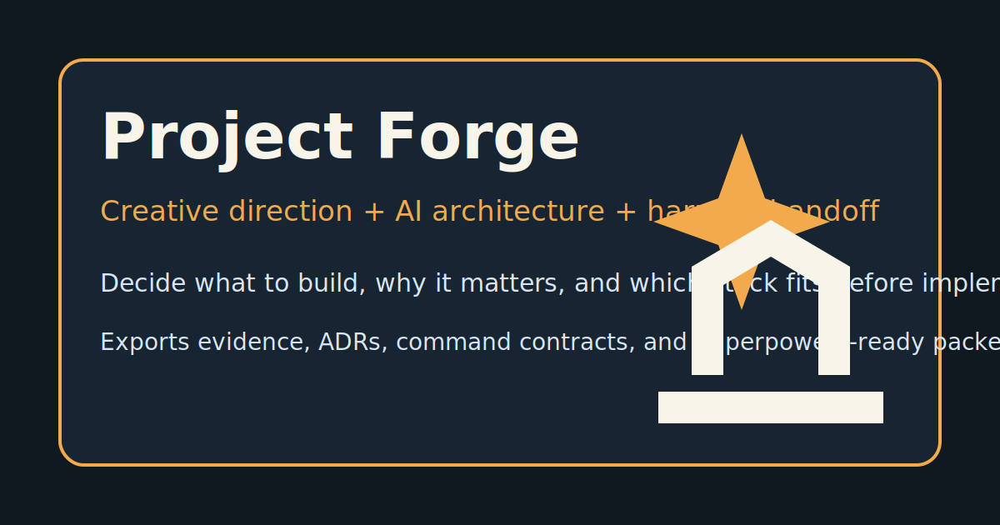

<p align="center">
  
</p>

<h1 align="center">Project Forge</h1>

<p align="center">
  <strong>Stop coding the wrong product faster.</strong>
</p>

<p align="center">
  The upstream decision layer for AI coding agents.<br>
  Turn a vague idea into evidence, an accepted architecture, a runnable harness, and a Superpowers-ready handoff.
</p>

<p align="center">
  <a href="https://github.com/Haozhenyu123/project-forge/actions/workflows/ci.yml"></a>
  <a href="CHANGELOG.md"></a>
  <a href="LICENSE"></a>
  
  
  
  <a href="https://github.com/Haozhenyu123/project-forge/stargazers"></a>
</p>

<p align="center">
  <a href="#why-project-forge">Why</a> ·
  <a href="#workflow">Workflow</a> ·
  <a href="#install">Install</a> ·
  <a href="#quick-start">Quick Start</a> ·
  <a href="#what-it-produces">Artifacts</a> ·
  <a href="#project-forge--superpowers">Superpowers</a> ·
  <a href="#中文快速入门">中文</a>
</p>

<p align="center">
  
</p>

## Why Project Forge

AI coding agents are very good at implementation. They are also very good at implementing an
unproven idea, an arbitrary framework choice, or an architecture nobody agreed on.

Project Forge inserts the missing decision layer before coding begins:

| Without Project Forge | With Project Forge |
|---|---|
| "Use the hottest framework" | Compare candidates against constraints and current evidence |
| Start coding from a one-line idea | Recommend three product angles and select a defensible default |
| Architecture lives in chat history | Record the decision, rejected options, confidence, and revisit triggers |
| "It should work" | Define install, test, lint, typecheck, build, run, and smoke contracts |
| Implementation agent re-decides everything | Hand over a bounded, machine-readable implementation packet |

> **Project Forge decides what to build, why it matters, and which architecture fits.**
> **Superpowers decides how to implement it reliably.**

## Workflow


The full loop is:

1. **Creative Director** turns ambiguity into three concrete product directions.
2. **AI Architect** researches comparable projects and ecosystem signals.
3. **Decision Engine** ranks stacks against product needs, constraints, risk, cost, and evidence.
4. **Harness Engineer** creates structured command contracts, CI, and smoke checks.
5. **Readiness Gate** verifies that the packet is safe and complete enough to hand over.
6. **Superpowers** consumes the accepted packet and begins implementation without reopening settled decisions.

## What It Produces

One run creates a reviewable decision packet inside your project:

```text
your-project/
├── project-forge.yaml
├── .github/workflows/project-forge-ci.yml
├── .project-forge/
│   ├── history/
│   ├── backups/
│   └── verification/<run-id>/report.json
└── docs/
    ├── creative-brief.md
    ├── product/creative-decision.json
    ├── research/<slug>/evidence.jsonl
    ├── architecture/ADR-0001-stack.md
    ├── architecture/inventory.json
    ├── harness.md
    ├── executive-summary.md
    ├── superpowers-handoff.md
    └── superpowers-handoff.json
```

| Role | What it decides | Primary output |
|---|---|---|
| AI Creative Design Director | Audience, pain point, product angle, differentiation, validation path | `creative-decision.json` |
| AI Architect | Stack, framework, topology, rejected options, confidence, revisit triggers | `ADR-0001-stack.md` |
| Evidence Layer | Freshness, source quality, licenses, activity, package and vulnerability signals | `evidence.jsonl` |
| Harness Engineer | Structured commands, service dependencies, CI, smoke strategy | `project-forge.yaml` |
| Agent Evaluator | Pressure scenarios, readiness checks, handoff quality | `evals/`, verification reports |

## Install

### Codex

```powershell
git clone https://github.com/Haozhenyu123/project-forge.git
cd project-forge
python scripts/cli.py plugin install --host codex
python scripts/cli.py plugin verify --host codex
```

Restart Codex after installation.

For personal marketplace compatibility, the repository also includes
`install/codex-marketplace.personal.json`:

```powershell
Copy-Item -Force "install/codex-marketplace.personal.json" "$env:USERPROFILE\.agents\plugins\marketplace.json"
```

### Claude Code

```powershell
git clone https://github.com/Haozhenyu123/project-forge.git
cd project-forge
python scripts/cli.py plugin install --host claude
python scripts/cli.py plugin verify --host claude
```

The native Claude Code plugin command remains available for a local checkout:

```text
/plugin install $env:USERPROFILE\plugins\project-forge
```

## Quick Start

### 1. Start from a vague idea

After installing the plugin, talk to Codex or Claude Code naturally:

```text
I want to build something that helps small teams make better technical decisions,
but the idea is still vague. Use Project Forge to recommend the best entry point.
```

Project Forge should recommend three product angles, choose a default, explain the commercial and
product reasoning, then ask for confirmation before treating the direction as accepted.

### 2. Ask for architecture

```text
Research the current ecosystem, compare realistic architecture options for the accepted direction,
choose a stack, explain why, and create a Project Forge harness and Superpowers handoff.
```

The architect uses available web tools and provider adapters for GitHub, npm, PyPI, OSV,
Stack Overflow, Bundlephobia, and npm Trends. Missing network access produces provisional evidence;
it does not invent citations.

### 3. Run the same flow from the CLI

Preview without writing:

```powershell
python scripts/cli.py init decision-hub `
  --goal "Help small teams compare architecture options before implementation" `
  --stack nextjs `
  --interactive `
  --dry-run
```

Create the decision packet:

```powershell
python scripts/cli.py init decision-hub `
  --goal "Help small teams compare architecture options before implementation" `
  --stack nextjs `
  --interactive
```

Verify the safe command subset:

```powershell
python scripts/cli.py superpowers-ready decision-hub `
  --slug decision-hub `
  --execute `
  --only test,build,smoke
```

### 4. Review an existing repository

Project Forge is not limited to greenfield projects:

```powershell
python scripts/cli.py inspect . --json
python scripts/cli.py audit . --json
```

Use this prompt in Codex or Claude Code:

```text
Audit this repository with Project Forge. If we made the architecture decision today,
would we choose the same stack? Show the evidence, risks, migration cost, and recommendation.
```

### 5. Compose a real multi-stack harness

```powershell
python scripts/cli.py harness compose `
  --slug decision-hub `
  --goal "Decision dashboard with an API service" `
  --primary nextjs:. `
  --secondary fastapi:api
```

Each stack receives its own `cwd`, structured `argv`, timeout, mutation flag, CI job, and smoke
strategy. Unconfigured commands are marked blocked instead of being replaced by fake placeholders.

## A Real Example

The repository includes a [Next.js + FastAPI showcase](examples/nextjs-fastapi-demo) that demonstrates:

- an evidence-backed product direction;
- primary and secondary stack contracts;
- architecture risks and effort estimation;
- a Schema v2 handoff packet;
- a human-readable executive summary;
- structural readiness for Superpowers.

Inspect it:

```powershell
python scripts/cli.py audit examples/nextjs-fastapi-demo --json
python scripts/cli.py superpowers-ready examples/nextjs-fastapi-demo --slug nextjs-fastapi-demo
python scripts/cli.py summary examples/nextjs-fastapi-demo
```

More examples: [Node.js research workflow](examples/team-research),
[FastAPI](examples/fastapi-demo), [Chrome Extension](examples/chrome-extension-demo), and
[CLI](examples/cli-demo).

## Architecture Decisions You Can Defend

Project Forge does not return a mysterious framework recommendation. Candidate scores can include:

- product and constraint fit;
- evidence freshness and source diversity;
- maintenance activity and ecosystem maturity;
- license and vulnerability risk;
- deployment cost and operational complexity;
- harness availability;
- alignment with the accepted creative direction.

Every score is evidence-aware. Missing evidence lowers confidence instead of creating fake precision.
Weights and candidate stacks can be customized.

## Harnesses, Not Hope

Supported templates:

| Template | Typical project |
|---|---|
| `nextjs` | Next.js App Router application |
| `fastapi` | Python FastAPI service |
| `node-ts` | Node.js + TypeScript application |
| `python` | General Python project |
| `electron` | Electron desktop application |
| `chrome-extension` | Manifest V3 browser extension |
| `cli` | Node.js command-line tool |
| `generic` | Explicit fallback for unsupported stacks |

Harness commands are structured as `argv`, `cwd`, `timeout_seconds`, and `mutates`. Project Forge
does not execute arbitrary legacy shell strings unless you explicitly allow them.

## Project Forge + Superpowers

Project Forge is designed as the upstream layer, not a reimplementation of Superpowers.

```text
Project Forge owns                         Superpowers owns
──────────────────────────────────────     ──────────────────────────────────
Product direction                         Implementation planning
Commercial and user reasoning             TDD
Research evidence                         Debugging
Architecture selection                    Code review
ADR, risks, and estimates                  Worktrees and Git workflow
Harness command contracts                 Branch completion
Readiness and handoff                      Implementation agents
```

The handoff packet tells Superpowers:

- which direction and architecture are already accepted;
- where the supporting evidence and ADR live;
- which command contracts define success;
- what the first implementation task is;
- when the work must return to Project Forge for a revised decision.

## Safety By Default

- Existing generated files are not overwritten unless `--force` is explicit.
- Forced updates create backups under `.project-forge/backups/`.
- Decision changes are recorded under `.project-forge/history/`.
- `inspect` is read-only and never reads secret values.
- `superpowers-ready` is structural unless `--execute` is explicit.
- `install` and long-running `run` commands are excluded unless explicitly included.
- Legacy shell strings require `--allow-legacy-shell`.
- Offline research is clearly marked provisional.
- Verification writes an auditable report with stdout and stderr per command.

## Useful Commands

```powershell
# Runtime health
python scripts/cli.py doctor

# Available templates
python scripts/cli.py list-templates

# Research an architecture question
python scripts/cli.py research --query "offline-first collaborative web application"

# Revisit an accepted decision
python scripts/cli.py revise . `
  --slug my-project `
  --reason "The implementation now requires strict offline support" `
  --constraint offline-first

# Audit implementation against the accepted ADR
python scripts/cli.py verify-implementation .

# Produce a stakeholder-friendly one-page summary
python scripts/cli.py summary .
```

## Verify

Run the repository checks:

```powershell
python -m pytest tests/ -q
python -m unittest tests/test_project_forge.py
python scripts/install_test.py
python scripts/evals/validate_scenarios.py evals/scenarios
python scripts/evals/e2e_real_test.py
```

Current local baseline: **132 automated tests** plus a **15-check end-to-end decision-to-handoff
flow**.

## Update

```powershell
git pull origin main
python scripts/cli.py plugin update --host codex
python scripts/cli.py plugin verify --host codex
python scripts/cli.py doctor
```

Use `--host claude` for the Claude Code bundle.

## 中文快速入门

Project Forge 负责编码之前最容易被忽略、也最昂贵的三件事：

1. 决定做什么产品、面向谁、从哪个切入点开始。
2. 说明为什么选择这个方向，市场、用户和技术证据是什么。
3. 选择架构、框架和 Harness，并解释为什么这样选择。

安装到 Codex：

```powershell
git clone https://github.com/Haozhenyu123/project-forge.git
cd project-forge
python scripts/cli.py plugin install --host codex
python scripts/cli.py plugin verify --host codex
```

重启 Codex 后可以直接说：

```text
我想做一个帮助小团队减少无效会议的产品，但想法还比较模糊。
请用 Project Forge 推荐三个切入方向，选择一个默认方向，并研究适合的架构。
```

Project Forge 会生成创意决策、研究证据、候选架构比较、ADR、风险、工程量估算、Harness、
CI 和 Superpowers 交接文件。它不会重新实现 Superpowers 的 TDD、调试、代码审查或 Git
工作流。

## Documentation

- [5-minute quickstart](docs/quickstart.md)
- [Architecture overview](docs/architecture.md)
- [Decision engine](docs/decision-engine.md)
- [Inventory scanner](docs/inventory.md)
- [Superpowers handoff protocol](docs/superpowers-handoff.md)
- [Readiness verification](docs/superpowers-ready.md)
- [Evaluation system](docs/evaluation.md)
- [Compatibility matrix](docs/compatibility.md)
- [Distribution and release](docs/distribution.md)

## Contributing

New evidence providers, stack templates, pressure scenarios, and host integrations are welcome.
Start with [CONTRIBUTING.md](CONTRIBUTING.md), then open an issue describing the decision or harness
gap you want to close.

## License

[MIT](LICENSE)
